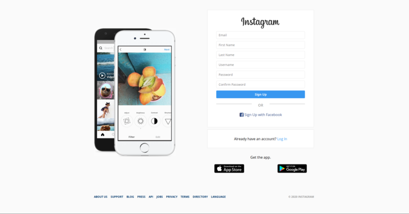
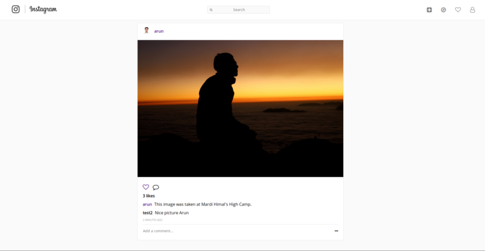
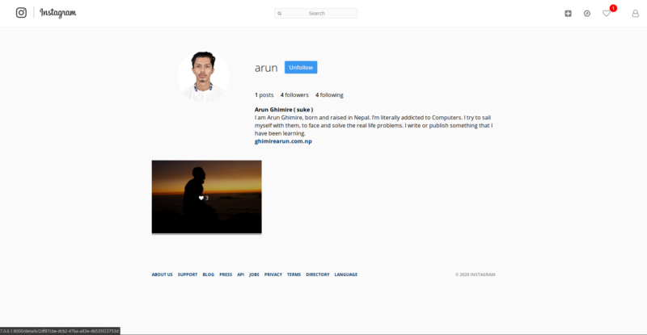
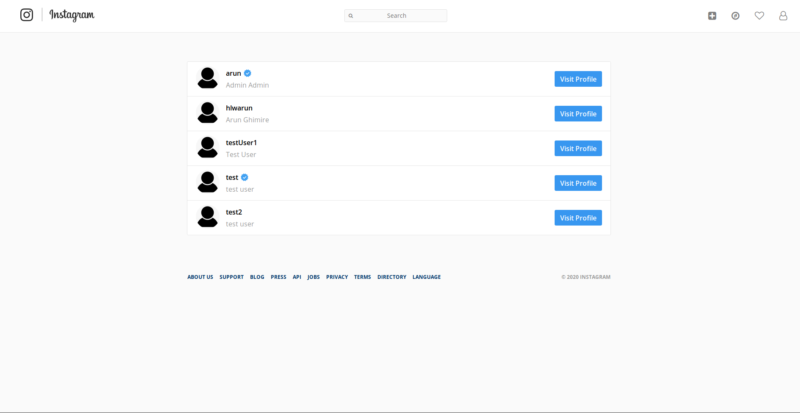

# Instagram Clone

This project is a clone of popular social media site 'Instagram'. It supports almost all the features that official Instagram supports. This website uses Django Python Web Framework for backend and fronted is written in plain html(HTML5), CSS and Javascript. This project is fully responsive and can be viewed in any of your devices.

### Features supported by the project.

    * User Registeration
    * User login and logout
    * Change password
    * Reset password via registered Email
    * Search User with username, First name, Last name
    * Accepts posts from users
    * Allow users to follow each other
    * Allow users to like posts
    * Allow users to comment on posts
    * Get notifications when followers like or comment your posts or follow you
    * See the count of unseen notifications on navbar
    * Allow users to visit profile of other users
    * Allow users to edit their profile informations
    * Allow users to upload profile picture
    * See any posts details
    * Allow users to upload profile picture

##### To run this project in your device follow the following steps:

    * Download or clone the repository
    * Unzip the downloaded zip file
    * Run pip install -r requirements.txt (for Python 2) OR pip3 install -r requirements.txt (for Python 3)
    * Connect the code with your database
    * Run python3 manage.py runserver

